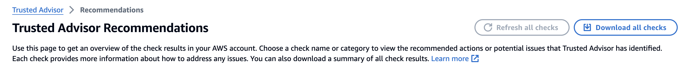

### How to Use
#### 1. Go to Trusted Advisor and Click "Download all checks"

#### 2. Edit filename in ta.py or ta.ipynb 
  fileName='all (5).xlsx' 
  lang='한글' # 한글 or 영어

  
#### 3. Required 
pip3 install duckdb
pip3 install spatial
pip3 install pyfiglet
pip3 install openpyxl
pip3 install pygwalker
pip3 install jupyterlab
pip3 install ipywidgets
pip3 install jupyterlab-widgets
pip3 install matlib
pip3 install xlsxwriter
pip3 install seaborn
